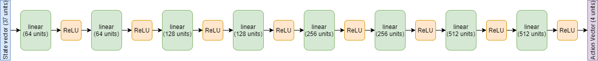
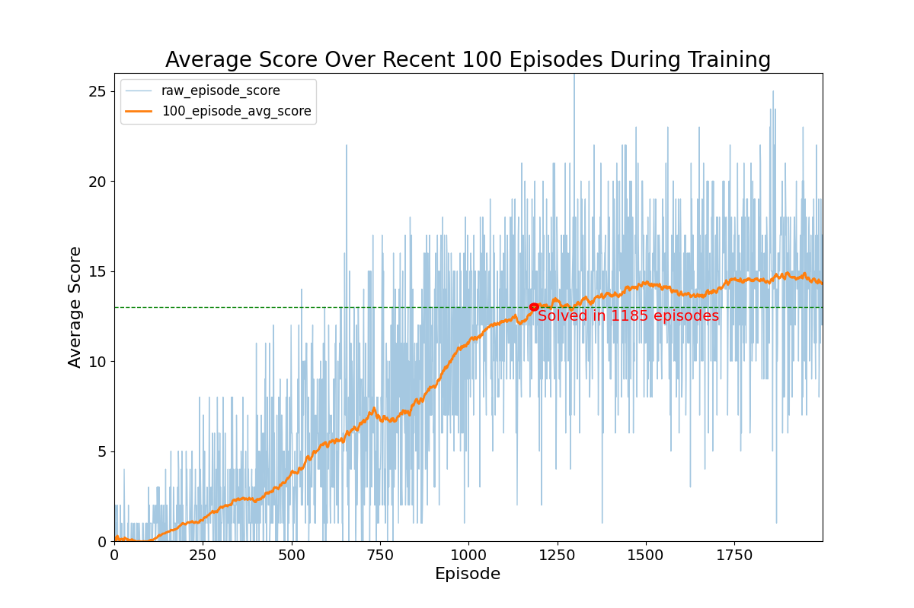

# BananaBotNavigation
Project code for developing an RL agent that navigates in a virtual world collecting bananas. Part of my work for the Deep RL Nanodegree on Udacity.

## Author

Chris Cadonic
chriscadonic@gmail.com

## Background

**
A full report describing much of my approach, results, and potential improvements can be found in the docs/Report.pdf. This is specifically
found [here](docs/Report.pdf).**

Prior to learning, if the agent acts completely randomly then the following is an example illustration of how the agent navigates the environment:


## Setup and Running

### Setup

Just as in outlined in , the following steps can be used to setup the environment:

1. Setup an `anaconda` environment (optional):
```
conda create --name drlnd python=3.6
```
and then activate this environment using:
```
conda activate drlnd
```
in MacOS and Linux or
```
activate drlnd
```
in Windows.

2. As in the DRLND repository, install dependencies after cloning this project repository using:
```
git clone https://github.com/udacity/deep-reinforcement-learning.git
cd deep-reinforcement-learning/python
pip install .
```

3. Setup the Unity environment

This environment is specifically provided by Udacity to contain the learning environment. A link to a file will be added here once verified that
such a link can be provided openly.


With the Unity environment acquired, the directory structure for this project should then be:

```
configs/...
docs/...
envs/...  <-- place the unzipped Unity environment directories here
models/...
navigation/...  <-- main code for project
output/...
README.md
runner.py
requirements.txt
```

### Running

The primary entry point for running the code is with the CLI tool `runner.py`. This can be called as in:
```
python runner.py
```
from the root of this project repository. Arguments can be provided as follows:
-`-t` (or `--train`): train the model with the provided configuration file (Defaults to False),
-`-c` (or `--config`): specify the configuration to use for training the model (Defaults to `configs/default_config.yaml`.

Thus, running the model to show inference using the final trained model without visualization can be run using:
```
python runner.py
```
or with visualization using:
```
python runner.py -c configs/default_vis_config.yaml
```

The model can also be retrained if one wishes by passing the `-t` or `--train` flag. Be careful as this will overwrite any output in the `output/` directory and saved models in the `models` directory, as specified by the configuration file.

If one wishes to change parameters, then you can create a new configuration file, or modify an existing configuration file, and provide parameters in the following format:
```
# general parameters
file_path: 'envs/Banana_Linux_NoVis/Banana.x86_64'
model_file: 'models/final-dqn.pkl'

# parameters for printing and controlling learning time
frame_time: 0.00
max_episodes: 2000
max_iterations: 10000

# model parameters
model_params:
  alg: 'dqn'
  # training parameters
  epsilon: 1.0
  epsilon_decay: 0.996
  epsilon_min: 0.05
  gamma: 0.99
  alpha: 0.001
  t_freq: 100
  tau: 0.01
  # parameters for the replay buffer
  buffer_size: 1000000
  batch_size: 256

  # architecture
  inter_dims: [64, 64, 128, 128, 256, 256, 512, 512]
```

## Results

Using vanilla DQN, the agent was able to learn quite well. I first trained a vanilla DQN with the following parameters,
optimized through hyperparameter search using grid search
(as opposed to any other optimization scheme, for the sake of simplicity):
- epsilon_decay = 0.996
- epsilon_min = 0.05
- learning_rate = 0.002
- gamma = 0.99
and using an iteratively deepening 8-layer neural network model as in:



With this setup, and the following arbitrarily chosen static parameters:
- target_update_frequency = 100 iterations
- tau = 0.01
- batch_size = 256
- replay_buffer_size = 1000000

The following results were acquired:



This illustrates that the model was able to learn how to navigate the banana world to acquire an average score of +13 over
100 episodes in 1185 episodes. After tuning parameters, particularly *epsilon_decay* and *learning_rate*, as the DQN algorithm
was particularly sensitive to these parameters, the model was able to consistently fair well across episodes. There appears
to also be some variability in raw episode score throughout training, which is a consequence of the lower bound of 0.05 on
*epsilon* to enable exploration all throughout training to at least a small degree.

An example visualization of the agent navigating through the banana world is shown below:


which shows a 15-second clip of the agent navigating through an episode. Interesting to see in this clip is that the agent
not only aims to grab yellow bananas, but has learned to try to avoid blue bananas when it almost accidentally picks one up.
